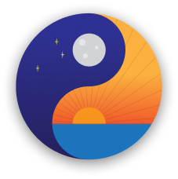

<!--
*** Thanks for checking out the Best-README-Template. If you have a suggestion
*** that would make this better, please fork the repo and create a pull request
*** or simply open an issue with the tag "enhancement".
*** Don't forget to give the project a star!
*** Thanks again! Now go create something AMAZING! :D
-->

<!-- PROJECT SHIELDS -->
<!--
*** I'm using markdown "reference style" links for readability.
*** Reference links are enclosed in brackets [ ] instead of parentheses ( ).
*** See the bottom of this document for the declaration of the reference variables
*** for contributors-url, forks-url, etc. This is an optional, concise syntax you may use.
*** https://www.markdownguide.org/basic-syntax/#reference-style-links
-->
[![Contributors][contributors-shield]][contributors-url]
[![Forks][forks-shield]][forks-url]
[![Stargazers][stars-shield]][stars-url]
[![Issues][issues-shield]][issues-url]

<!-- PROJECT LOGO -->
 

  

<h3 align="center">Steady</h3>

  

    A web application created with Next.js for self-therapy.
     
    <!--
    <a href="https://github.com/github_username/repo_name"><strong>Explore the docs »</strong></a>
     
     
    <a href="https://github.com/github_username/repo_name">View Demo</a>
    ·
    <a href="https://github.com/github_username/repo_name/issues">Report Bug</a>
    ·
    <a href="https://github.com/github_username/repo_name/issues">Request Feature</a>
    !-->
  

<!-- TABLE OF CONTENTS

  
Table of Contents

  <ol>
    <li>
      <a href="#about-the-project">About The Project</a>
      <ul>
        <li><a href="#built-with">Built With</a></li>
      </ul>
    </li>
    <li>
      <a href="#getting-started">Getting Started</a>
      <ul>
        <li><a href="#prerequisites">Prerequisites</a></li>
        <li><a href="#installation">Installation</a></li>
      </ul>
    </li>
    <li><a href="#usage">Usage</a></li>
    <li><a href="#roadmap">Roadmap</a></li>
    <li><a href="#contributing">Contributing</a></li>
    <li><a href="#license">License</a></li>
    <li><a href="#contact">Contact</a></li>
    <li><a href="#acknowledgments">Acknowledgments</a></li>
  </ol>

!-->

<!-- ABOUT THE PROJECT -->
## About The Project

[![Product Name Screen Shot][product-screenshot]]

Steady was a web application designed and developed by BCIT first year students enrolled in the Digital Design & Development program. It was made to tackle the social issue of depression and its symptoms, such as lack of eating, sleep, and exercise.

The application asks the user questions based on their mood and returns an answer that best suits their mood. For example, in the case that a user has only eaten 1 meal by the end of the day, the application will recommend you to eat more, and vice-versa.

The application went through research, ideation, design, prototyping, development, and testing phases over the course of 10 weeks, learning every aspect of web application development. In the end, we created a product that tested our capabilities at that point in time with plenty of room for improvement.

(<a href="#top">back to top</a>)

### Team Members

* [William Alvarez](https://github.com/wilyyy)
* [Ibjyot Gill](https://github.com/ibbygill)
* [Danny Nguyen](https://github.com/dnguyen130)
* [Jody Prinsloo](https://github.com/JodyPrinsloo)

### Built With

* [Next.js](https://nextjs.org/)
* [React.js](https://reactjs.org/)
* [Styled-Components](https://styled-components.com/)

(<a href="#top">back to top</a>)

<!-- MARKDOWN LINKS & IMAGES -->
<!-- https://www.markdownguide.org/basic-syntax/#reference-style-links -->
[contributors-shield]: https://img.shields.io/github/contributors/wilyyy/Steady
[contributors-url]: https://github.com/wilyyy/Steady/graphs/contributors
[forks-shield]: https://img.shields.io/github/forks/wilyyy/Steady
[forks-url]: https://github.com/wilyyy/Steady/network/members
[stars-shield]: https://img.shields.io/github/stars/wilyyy/Steady
[stars-url]: https://github.com/wilyyy/Steady/stargazers
[issues-shield]: https://img.shields.io/github/issues/wilyyy/Steady
[issues-url]: https://github.com/wilyyy/Steady/issues
[license-shield]: https://img.shields.io/github/license/wilyyy/Steady
[license-url]: https://github.com/github_username/repo_name/blob/master/LICENSE.txt
[linkedin-shield]: https://img.shields.io/badge/-LinkedIn-black.svg?style=for-the-badge&logo=linkedin&colorB=555
[linkedin-url]: https://linkedin.com/in/linkedin_username
[product-screenshot]: public/screenshot.png
